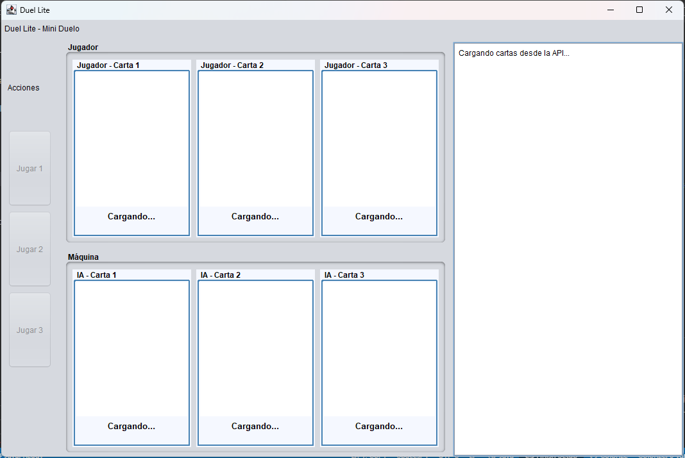
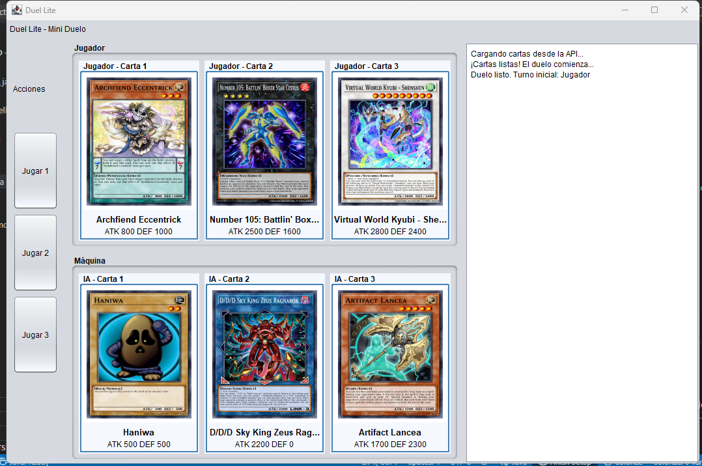
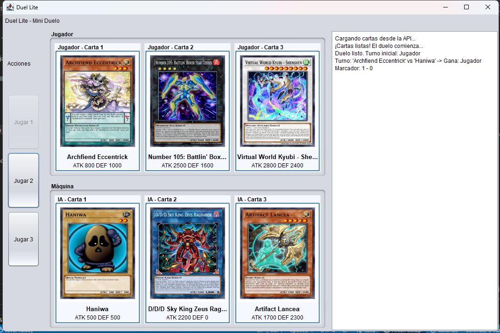
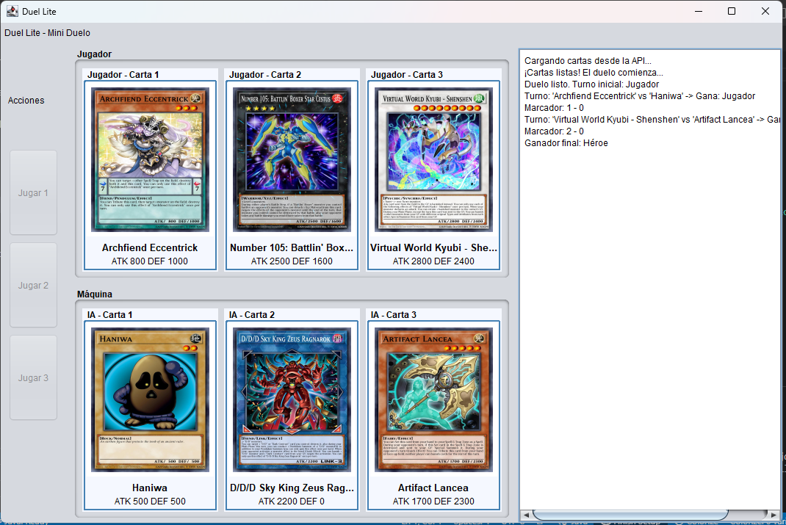

# Yu-Gi-Oh! Duel Lite

Duelo simplificado de Yu-Gi-Oh! contra la máquina.

## Integrantes
- Adrian Felipe Velasquez Arias
- Manuel Alexander Serna Jaraba

## Cómo ejecutar

### Requisitos:
- Java 17
- Maven

### Pasos:
1. Ejecutar en IDE:
   - Abrir como proyecto Maven
   - Ejecutar `App.java`

2. O por consola:
   ```bash
   mvn clean compile exec:java
   ```

## Cómo jugar
1. Elige una de tus 3 cartas  
2. La máquina elige al azar  
3. Gana el primero en 2 victorias  

## Estructura
```
src/
├── main/java/com/duellite/
│   ├── App.java          # Inicio
│   ├── core/             # Lógica
│   ├── domain/           # Modelos
│   ├── net/              # API
│   └── ui/               # Interfaz
```

## API
- Usa YGOProDeck API  
- Solo cartas Monster  

---

## 📸 Capturas de pantalla

### Carga de cartas


### Cartas cargadas correctamente


### Elección de carta por el jugador


### Pantalla de victoria


---

## 🎨 Explicación de diseño

El diseño de *Yu-Gi-Oh! Duel Lite* se centra en la simplicidad y la claridad visual. La interfaz gráfica fue desarrollada con **Java Swing**, utilizando una estructura dividida por secciones que representan las cartas del jugador, las cartas de la máquina y el registro del duelo. Se prioriza la legibilidad, con bordes definidos, tipografía limpia y disposición simétrica de los paneles.  

Cada carta se muestra dentro de un contenedor individual con su imagen, nombre y estadísticas de ataque/defensa, mientras que el panel lateral derecho registra el progreso del duelo en tiempo real. Este enfoque permite una experiencia fluida, intuitiva y visualmente ordenada, ideal para representar de forma ligera el espíritu de los duelos de Yu-Gi-Oh.
